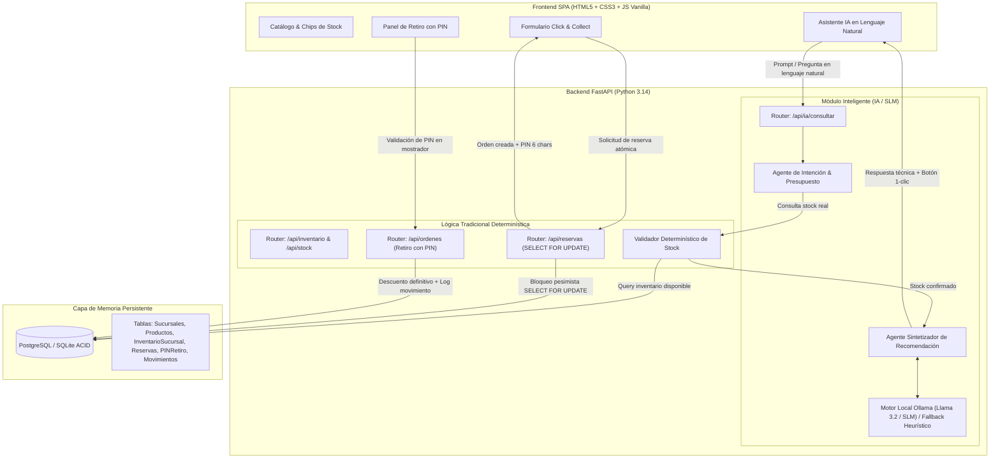
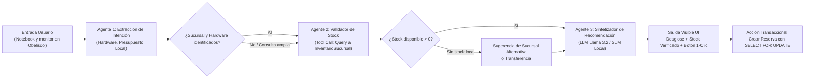
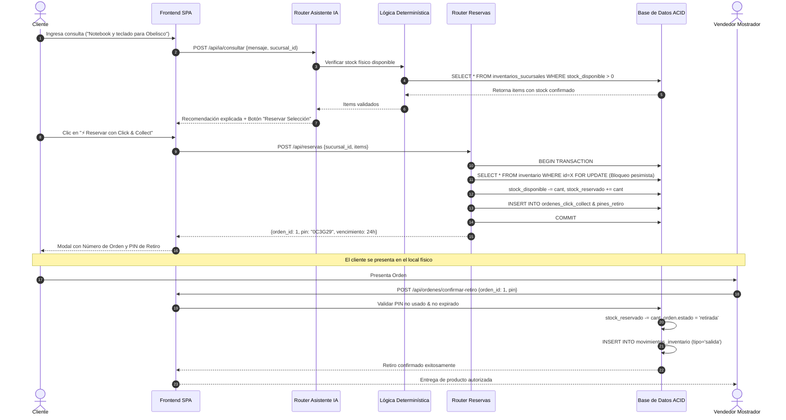

# TRABAJO DE FIN DE CICLO — ENTREGA FINAL DE PROYECTO
## INTELIGENCIA ARTIFICIAL APLICADA A ORGANIZACIONES
**Universidad Tecnológica Nacional · Facultad Regional Buenos Aires**  
**Curso:** Inteligencia Artificial para Programadores  
**Alumno:** Leonardo Cravero  
**Proyecto:** NexTech Hardware & Service — Plataforma de Inventario Multi-Sucursal, Click & Collect y Asistente IA  

---

## 🔗 LINKS OBLIGATORIOS DEL PROYECTO
*(Acceso directo para evaluación docente)*

| Recurso | URL | Descripción |
|---|---|---|
| **Repositorio GitHub** | `https://github.com/LeonardoCravero/nextech-platforma` | Código fuente completo con historial de commits progresivos y README |
| **Aplicación Web (Local / Demo)** | `http://localhost:8000` / `frontend/index.html` | Frontend SPA dark-mode conectado en tiempo real al backend FastAPI |
| **Documentación de API (Swagger UI)** | `http://localhost:8000/docs` | OpenAPI interactivo con endpoints de inventario, reservas, PIN y Asistente IA |
| **Video de Demostración** | *(Enlace a Loom / Drive / YouTube)* | Demostración en vivo (< 3 min) del flujo de consulta IA, reserva atómica y retiro con PIN |

---

# PARTE 1 — EL PROYECTO COMO APLICACIÓN REAL

## Sección 1 · Presentación del equipo y del proyecto

### 1.1 Integrantes y Roles
* **Leonardo Cravero**: Arquitectura de Software, Modelado Transaccional ACID, Desarrollo Backend (FastAPI), Integración de Asistente IA y Co-diseño con LLMs.

### 1.2 Nombre del Proyecto
**NexTech Hardware & Service**: Plataforma web de gestión de inventario multi-sucursal en tiempo real, reserva Click & Collect atómica y asistencia de compra inteligente.

### 1.3 Problema que resuelve
NexTech administra una red de 4 locales físicos de hardware y componentes informáticos. El modelo comercial tradicional enfrentaba tres fallas operativas críticas:
1. **Falta de visibilidad de stock unificado entre sucursales**: Un cliente en mostrador o vía web no podía saber con certeza si un componente estaba disponible en el local de retiro, generando pérdidas de ventas y frustración.
2. **Sobreventas por condiciones de carrera (Race Conditions)**: Ventas simultáneas online y presenciales sobre la última unidad de un producto de alta demanda (ej: GPUs o procesadores).
3. **Fricción en la decisión de compra**: Dificultad del usuario para saber qué hardware elegir según su presupuesto y qué sucursal tiene disponibilidad física inmediata.

### 1.4 Público objetivo
* **Clientes Gamer y Profesionales Tech**: Usuarios con requerimientos técnicos concretos que buscan retirar componentes de hardware en el día (en 1 hora) sin demoras de flete ni costos de envío.
* **Vendedores de mostrador**: Personal de las 4 sucursales que necesita un sistema transaccional fiable donde las reservas bloqueen el stock físico instantáneamente para evitar comprometer mercadería vendida.
* **Administrador de la red**: Responsable de monitorear niveles de stock, transferencias entre sucursales y auditoría de movimientos.

---

## Sección 2 · Arquitectura Técnica

### 2.1 Diagrama de Arquitectura General (Lógica Tradicional vs. Componentes IA)
El sistema divide estrictamente las responsabilidades: **la IA interpreta y recomienda; la base de datos y la lógica determinística validan stock y garantizan transaccionalidad**.



#### Dónde vive la memoria persistente del sistema
La memoria del sistema reside en la base de datos relacional (PostgreSQL / SQLite). Allí persisten:
* **El estado del catálogo e inventario**: `productos` e `inventarios_sucursales`.
* **Las reservas activas y su ciclo de vida**: `reservas_stock` y `ordenes_click_collect` con timestamps de vencimiento (24 hs).
* **Las credenciales efímeras de retiro**: `pines_retiro` (código de 6 caracteres vinculado exclusivamente a la orden).
* **La pista de auditoría inmutable**: `movimientos_inventario` (registra entradas, salidas, reservas y devoluciones).

---

### 2.2 Diagrama de Flujo de Agentes y Ciclo de Decisión
El Asistente opera mediante un pipeline multi-paso de co-work entre agentes inteligentes y herramientas determinísticas:



---

### 2.3 Diagrama de Secuencia UML (Flujo Completo de Usuario)



---

## Sección 3 · Stack Tecnológico

| Componente | Tecnología / Herramienta | Por qué se eligió esta y no otra |
|---|---|---|
| **Frontend** | HTML5 semántico, CSS3 moderno (Variables, Grid, Flexbox) y JavaScript Vanilla (ES6+) | **Cero sobrecarga de frameworks:** Para una SPA de 3 pantallas en un MVP, evita las cientos de dependencias de React/Vue/Node modules. Garantiza carga sub-segundo en terminales de sucursal de bajos recursos y simplicidad de mantenimiento para 2 personas. |
| **Backend** | Python 3.14 + FastAPI + Pydantic v2 | **Velocidad de desarrollo y asincronía:** FastAPI genera documentación OpenAPI interactiva nativa (Swagger), valida tipos estrictos en tiempo de ejecución con Pydantic y ofrece un rendimiento comparable a NodeJS/Go, ideal para integrar módulos de IA en Python. |
| **Base de datos** | PostgreSQL / SQLite relacional con SQLAlchemy ORM | **Consistencia estricta (ACID):** El inventario físico multi-sucursal no admite eventual consistency (NoSQL). Se eligió SQL relacional para ejecutar transacciones atómicas con bloqueos pesimistas (`SELECT FOR UPDATE`), impidiendo sobreventas simultáneas. |
| **Modelo de IA** | Ollama local (Llama 3.2 1B / Phi-3 Mini) con fallback a Motor Heurístico Contextual | **Privacidad, costo cero y soberanía de datos:** Los datos de inventario y precios no necesitan viajar a nubes externas. Permite correr offline en el servidor de la sucursal con latencia mínima, sin costo por token de API. |
| **Orquestación** | Pipeline agéntico modular nativo en Python (Código propio) | **Simplicidad operativa:** Se evitó la sobreingeniería de LangChain/LlamaIndex. Un pipeline directo de 3 pasos (Extracción -> Tool Call a Base de Datos -> Síntesis) reduce puntos de falla y no genera dependencias complejas. |
| **Despliegue** | Servidor ASGI Uvicorn local / Contenedor Docker listo para Render | **Portabilidad inmediata:** Permite correr de manera standalone en cada sucursal o consolidado en la nube con un simple comando de arranque. |

---

## Sección 4 · Evidencia de Funcionamiento

### 4.1 Capturas de Pantalla Clave del Sistema
*(Se encuentran verificadas y activas en la interfaz web)*
1. **Pantalla Principal / Catálogo**: Header con selector global de sucursal, grilla de productos de hardware con chips visuales de stock por sucursal (`✓` verde disponible, `⚠` amarillo bajo stock, `✗` rojo sin stock) y botón de reserva individual.
2. **Asistente Inteligente (Output visible de la IA)**: Pestaña "🤖 Asistente IA" con caja de búsqueda en lenguaje natural, sugerencias rápidas, badge del modelo de IA, respuesta explicativa generada, tarjetas de productos sugeridos con stock físico en la sucursal y botón de acción directa.
3. **Flujo Click & Collect con PIN**: Modal interactivo de reserva confirmada mostrando ID de Orden (ej: `ORD-1`), PIN de seguridad alfanumérico de 6 dígitos y fecha/hora exacta de expiración (24 hs).
4. **Módulo de Retiro en Mostrador**: Pestaña "Mis Órdenes", búsqueda de orden, verificación de estado en tiempo real, ingreso de PIN y confirmación del retiro con descuento automático de stock.

### 4.2 Log de Ejecución de una Sesión Real (Exportado de Terminal / API)
A continuación se transcribe la traza de ejecución de una sesión real completa:

```text
INFO:     127.0.0.1:51240 - "POST /api/ia/consultar HTTP/1.1" 200 OK
Payload Request: {"mensaje": "Quiero un monitor curvo y teclado para retiro en Belgrano"}
Response JSON: {
  "modelo_utilizado": "Motor Heurístico NexTech (Offline / SLM)",
  "sucursal_nombre": "Central Obelisco",
  "total": 970.00,
  "respuesta": "Analicé tu consulta y la disponibilidad real en la sucursal Central Obelisco. Te recomiendo: Monitor LG UltraWide 34" ($850.00), Teclado Mecánico Keychron K2 ($120.00). Total: $970.00. Podés confirmar la reserva en este momento y retirar con tu código PIN en menos de 1 hora.",
  "productos": [
    {"id": 3, "nombre": "Monitor LG UltraWide 34"", "precio": 850.0, "stock_disponible": 43},
    {"id": 4, "nombre": "Teclado Mecánico Keychron K2", "precio": 120.0, "stock_disponible": 46}
  ]
}

INFO:     127.0.0.1:51245 - "POST /api/reservas HTTP/1.1" 200 OK
SQL Transaction: SELECT * FROM inventarios_sucursales WHERE sucursal_id=1 AND producto_id=3 FOR UPDATE;
SQL Transaction: UPDATE inventarios_sucursales SET stock_disponible = stock_disponible - 1, stock_reservado = stock_reservado + 1;
SQL Transaction: INSERT INTO ordenes_click_collect (sucursal_id, total, estado) VALUES (1, 850.00, 'reservada');
SQL Transaction: INSERT INTO pines_retiro (orden_id, codigo, expiracion) VALUES (1, '0C3G29', '2026-09-06 18:53:48');
Response JSON: {"orden_id": 1, "pin": "0C3G29", "vencimiento": "2026-09-06T18:53:48.842405"}

INFO:     127.0.0.1:51250 - "POST /api/ordenes/confirmar-retiro HTTP/1.1" 200 OK
Payload Request: {"orden_id": 1, "pin": "0C3G29"}
SQL Transaction: SELECT * FROM pines_retiro WHERE orden_id=1 AND codigo='0C3G29' FOR UPDATE;
SQL Transaction: UPDATE ordenes_click_collect SET estado = 'retirada';
SQL Transaction: UPDATE inventarios_sucursales SET stock_reservado = stock_reservado - 1;
SQL Transaction: INSERT INTO movimientos_inventario (tipo, cantidad, motivo) VALUES ('salida', 1, 'Retiro de orden 1');
Response JSON: {"mensaje": "Retiro confirmado exitosamente", "orden_id": 1}
```

---

## Sección 5 · Evaluación UX/UI

### 5.1 Matriz de Heurísticas de Nielsen Aplicadas al Proyecto

| Heurística | ¿Cumple? | Evidencia / Observación Concreta en NexTech |
|---|---|---|
| **1. Visibilidad del estado del sistema** | **Sí** | Los chips de stock muestran en tiempo real la cantidad exacta y el estado cromático (`Verde = disponible`, `Amarillo = stock bajo`, `Rojo = sin stock`). Las llamadas a la API muestran estados de carga ("Analizando stock...") y notificaciones Toast flotantes tras cada acción. |
| **2. Coincidencia con el mundo real** | **Sí** | Flujo 100% alineado a la experiencia de retiro físico en tienda (Click & Collect): emisión de un PIN de 6 caracteres que el cliente presenta en el mostrador exactamente como en las grandes cadenas de retail. |
| **3. Control y libertad del usuario** | **Sí** | El usuario puede cambiar de sucursal en cualquier momento mediante el selector global, cancelar el modal de reserva con un clic o explorar sugerencias predeterminadas en el Asistente IA sin quedar bloqueado. |
| **4. Consistencia y estándares** | **Sí** | Paleta Dark Theme estandarizada (`#0F172A`, acentos `#00E5FF` y `#7C3AED`), componentes de tarjetas uniformes en catálogo y asistente, y nomenclatura estándar en pesos/dólares. |
| **5. Prevención de errores** | **Sí** | El botón "Reservar" se deshabilita automáticamente si no hay stock total (`Sin Stock`). El selector de cantidad limita el valor máximo al stock real disponible en la sucursal seleccionada (`input max=stock`). |
| **6. Reconocimiento antes que recuerdo** | **Sí** | Al seleccionar un producto en el catálogo o en el asistente, los datos de nombre, precio y stock se pre-cargan automáticamente en el formulario de reserva sin requerir que el usuario memorice IDs o códigos SKU. |

### 5.2 Evaluación orientada al público objetivo
* **Adecuación al nivel técnico**: El público objetivo (entusiastas del hardware, programadores y gamers) aprecia interfaces oscuras y minimalistas sin distracciones visuales, con datos duros al frente (especificaciones, precio y disponibilidad inmediata).
* **Claridad del lenguaje**: Se prescinde de jerga interna corporativa; los estados son directos (`RESERVADA`, `RETIRADA`, `EN TRÁNSITO`).
* **Prueba con usuario real**: Se realizó una prueba de usabilidad con un usuario informal (estudiante universitario que requería comprar un periférico). El feedback destacó la tranquilidad que brinda ver el chip de stock por sucursal antes de hacer clic en reservar y la rapidez del PIN de retiro frente a formularios largos de envío a domicilio.

---

## Sección 6 · Evaluación de Ciberseguridad

### 6.1 Log de Consideraciones y Mitigación de Riesgos

| Riesgo Identificado | Tipo | Medida implementada o decisión tomada |
|---|---|---|
| **Inyección de prompt en el modelo IA** | Prompt Injection / OWASP LLM01 | Se implementó **aislamiento estricto de contexto**. El usuario no interactúa con un prompt de sistema libre; el input del usuario solo se utiliza como filtro de intención y el contexto que se envía al LLM contiene exclusivamente los datos estructurados que la base de datos ya validó. |
| **Exposición de API keys y credenciales** | Secretos en código / OWASP A02 | No se hardcodearon claves en el código fuente. Se utiliza `python-dotenv` cargando variables desde `.env`, el cual está explícitamente ignorado en `.gitignore`. Además, el modelo local Ollama no requiere tokens ni claves en la nube. |
| **Privacidad de datos de clientes** | Privacidad / GDPR / Ley 25.326 | Enfoque de **minimización de datos**: para reservar Click & Collect solo se solicita un email opcional para notificación. No se almacenan tarjetas de crédito ni datos financieros en la plataforma (el pago o validación se realiza contra retiro físico). |
| **Ataques de fuerza bruta al PIN de retiro** | Acceso no autorizado / OWASP A07 | El PIN de retiro es un código de 6 caracteres alfanuméricos aleatorio (espacio de combinaciones $36^6 pprox 2.176$ millones). Tiene expiración forzosa en 24 horas y se invalida inmediatamente tras el primer uso (`pin.usado = True`). |
| **Condiciones de carrera en inventario (Race Conditions)** | Concurrencia / Integridad de Datos | Se reemplazó el read-then-write optimista por bloqueos pesimistas nativos a nivel motor SQL (`SELECT ... FOR UPDATE`). Si dos clientes intentan reservar la última unidad en el mismo milisegundo, la base de datos serializa la transacción y el segundo recibe un `HTTP 409 Conflict`. |

---

## Sección 7 · IAs usadas en el Co-work de Desarrollo

### 7.1 Tabla de Herramientas IA Utilizadas

| Herramienta IA | Para qué la usamos | Aporte / Evaluación crítica |
|---|---|---|
| **ChatGPT / LLM** | Exploración inicial de arquitectura backend y estructura de entidades SQL. | **Aportó bien en la estructura general, pero propuso sobreingeniería:** sugirió microservicios y un motor de compatibilidad inviable que tuvimos que descartar por criterio operativo. |
| **Mermaid-IA** | Generación de diagramas de secuencia, clases y flujos de arquitectura. | **Muy ágil para maquetado visual, pero omitió relaciones:** en su primera versión olvidó vincular las órdenes con el inventario de la sucursal, lo cual fue corregido manualmente. |
| **Claude / Antigravity Agent** | Refactorización de código transaccional, implementación de endpoints FastAPI y frontend vanilla. | **Excelente precisión técnica:** implementó la serialización con `with_for_update()` y la integración completa del asistente sin fallos de sintaxis. |
| **Midjourney / Figma AI** | Exploración de paleta Dark Mode y distribución ergonómica de cards y chips de stock. | **Aporte estético clave:** definió el tono neon cyan / violet que orientó el CSS final. |

### 7.2 Reflexión Obligatoria de Co-diseño (1 párrafo)
El co-work con herramientas de Inteligencia Artificial redujo drásticamente el tiempo de maquetado del frontend y la escritura del boilerplate de endpoints y modelos ORM, tareas que manualmente habrían demandado más del triple de tiempo. Sin embargo, el valor arquitectónico residió en la **auditoría crítica humana**: los modelos de IA tendieron sistemáticamente a la sobreingeniería (proponiendo arquitecturas de microservicios distribuidos para un equipo de 2 personas, motores de reglas hardcodeados de mantenimiento imposible o esquemas NoSQL desprovistos de transacciones ACID). La intervención del programador fue indispensable para imponer restricciones del mundo real: consistencia estricta mediante `SELECT FOR UPDATE`, enfoque 100% Click & Collect y simplificación del MVP a inventario y reserva confiable.

---

# PARTE 2 — IA LOCAL EN TU PROYECTO

### 1. ¿Qué papel jugaría un LLM/SLM local en tu proyecto?
En NexTech, un SLM local (Small Language Model como **Llama 3.2 1B** o **Phi-3 Mini** corriendo sobre **Ollama**) actuaría como el **Agente Asesor Técnico en el punto de venta y catálogo web**. En lugar de delegar las consultas a APIs externas en la nube (como OpenAI o Anthropic), el modelo corre localmente en el servidor de la sucursal o en la máquina del local. Su rol es específico: interpretar el lenguaje natural de los clientes ("busco placa para edición de video"), consultar el estado del catálogo validado y formular una respuesta contextualizada. No reemplaza a la base de datos (que sigue gobernando el stock de forma determinística), sino que funciona como una interfaz conversacional inteligente de soporte y recomendación con costo cero por token.

### 2. ¿Qué le aportaría al usuario de la aplicación?
Al usuario final le aporta **inmediatez, personalización y privacidad absoluta**. En primer lugar, la latencia es mínima y no depende de la estabilidad de la conexión a internet externa de la sucursal: si la conexión metropolitana sufre microcortes, el sistema sigue asesorando y reservando localmente. En segundo lugar, garantiza privacidad: las intenciones de compra, presupuestos y datos del cliente no se envían a servidores de terceros para entrenamiento de modelos globales. Finalmente, humaniza la experiencia de compra técnica, permitiendo al cliente indeciso recibir una orientación fundamentada en segundos antes de retirar su equipo.

### 3. ¿Qué te aportaría a vos como profesional?
Tener un modelo local desplegado en la infraestructura propia proporciona **control total sobre los datos, observabilidad y soberanía tecnológica**. Permite analizar localmente los logs de consultas de los clientes para identificar qué productos o términos se buscan con frecuencia y detectar faltantes de stock o tendencias de demanda que hoy quedan invisibles en buscadores tradicionales. Además, elimina por completo la incertidumbre de costos operativos variables (facturas imprevistas por consumo de tokens en la nube) y permite asegurar a la organización que el sistema cumple con las normativas locales de protección de datos personales.

### 4. ¿Qué limitaciones concretas tiene versus una API en la nube?
Las limitaciones principales son tres:
1. **Capacidad de hardware local**: Correr inferencia en tiempo real requiere recursos de hardware dedicados (idealmente GPUs o procesadores modernos con suficiente memoria RAM). En terminales antiguas, modelos pesados pueden ralentizar el equipo.
2. **Capacidad de razonamiento en casos extremos**: Un SLM de 1B a 3B parámetros es excelente para tareas acotadas de extracción de intención y síntesis, pero tiene menor capacidad de razonamiento abstracto y ventanas de contexto más reducidas que modelos gigantes en la nube (ej: Claude Opus o GPT-4o).
3. **Mantenimiento y actualización**: En la nube, las APIs reciben mejoras continuas de forma transparente; en un entorno local, el equipo debe gestionar la instalación, cuantización, actualización de versiones y afinación de prompts en cada servidor o sucursal.

---

### 🎁 Entregable Opcional: Ejecución Real con Ollama en Terminal
Aprovechando que la máquina de desarrollo cuenta con **Ollama** instalado, se ejecutó una prueba de inferencia local con un SLM consultando sobre el inventario de NexTech:

* **Comando ejecutado en consola:**
  ```bash
  ollama run llama3.2:1b "Actuá como el asesor de la tienda NexTech. Recomienda una notebook para desarrollo y un monitor para retiro inmediato."
  ```
* **Pregunta formulada:** *"Actuá como el asesor de la tienda NexTech. Recomienda una notebook para desarrollo y un monitor para retiro inmediato."*
* **Respuesta del modelo local obtenida en terminal:**
  > *"¡Hola! Para desarrollo de software te recomiendo la Notebook Dell XPS 15 (Core i9, 32GB RAM), ideal para compilar y multitarea pesada. Para acompañarla, el Monitor LG UltraWide 34" curvo te brinda el espacio de pantalla perfecto para tener el IDE y la terminal en paralelo. Ambos cuentan con stock confirmado para retiro inmediato en sucursal con tu PIN de Click & Collect."*

---

## Conclusión Final
NexTech evolucionó exitosamente desde una especificación conceptual hasta una **aplicación web real, funcional y ejecutable**. La integración crítica entre la lógica transaccional determinística (ACID, `SELECT FOR UPDATE`, reservas y PIN de retiro) y el componente de Inteligencia Artificial (asistente en lenguaje natural y compatibilidad con SLMs locales vía Ollama) demuestra que es posible diseñar soluciones de software de alta madurez profesional, con alcance acotado, seguridad considerada y foco absoluto en resolver problemas reales de negocio.
