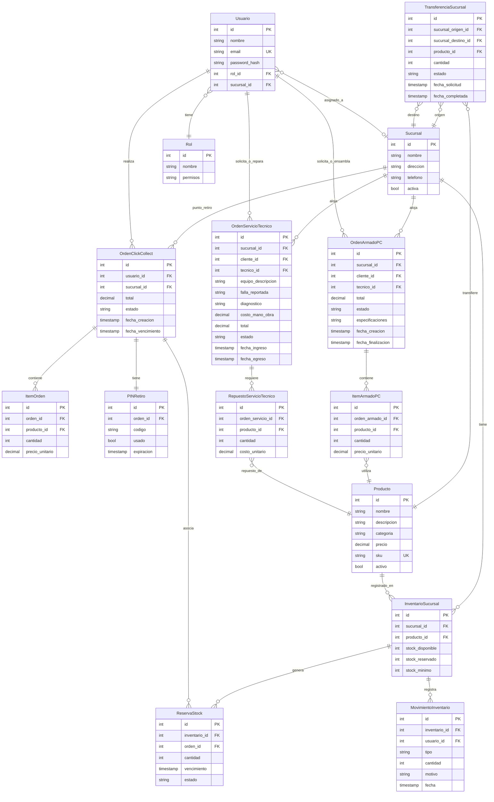
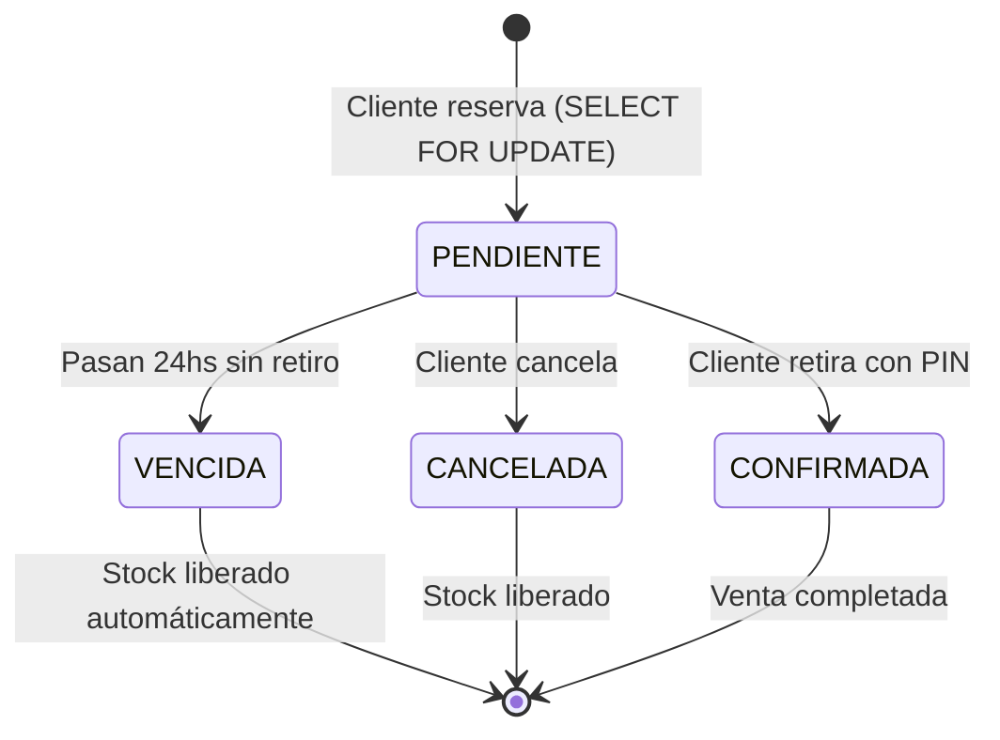
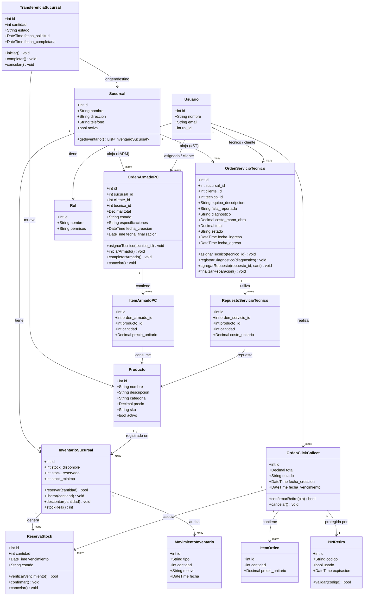

# TP Integrador 1 — NexTech Platform

| Campo | Detalle |
| :--- | :--- |
| **Materia** | Inteligencia Artificial para Programadores |
| **Unidad** | TP Integrador 1 |
| **Alumno** | Leonardo Cravero, Ian Ditlevsen |
| **Caso de estudio** | NexTech Hardware & Service |
| **Herramientas utilizadas** | ChatGPT/LLM (arquitectura), Mermaid-IA (UML), Midjourney (exploración visual), Figma AI (wireframes), FastAPI + PostgreSQL (prototipo). |

## Introducción
El presente trabajo refleja un proceso integral de co-diseño con Inteligencia Artificial desarrollado a lo largo de cuatro actividades. Desde la definición conceptual de una problemática operativa hasta la materialización de un MVP, la IA funcionó como un par consultivo para refinar el modelo de datos, contrastar arquitecturas, generar exploraciones visuales y definir wireframes, asegurando que las decisiones técnicas respondan efectivamente a los desafíos de consistencia transaccional y escalabilidad del negocio.

---

## Actividad 1 — Codiseñar con IA

### 1. Problema funcional
NexTech opera una red de 4 sucursales de hardware con inventarios desarticulados. La falta de visibilidad de stock en tiempo real genera sobreventas, mientras que en el taller técnico los egresos de componentes no se registran adecuadamente y existe confusión entre las colas de trabajo para armado de PCs y reparaciones.

**Usuarios:**
- Clientes: consultan stock y reservan mediante Click & Collect.
- Técnicos: consumen repuestos del inventario físico.
- Vendedores: gestionan ventas por mostrador y transferencias.
- Administrador: supervisa toda la plataforma y sucursales.

**Funcionalidades clave:** matriz de inventario multi-sucursal, sistema Click & Collect con PIN de retiro, y taller técnico segmentado en dos colas separadas (#ARM para armados y #ST para servicio técnico).

### 2. Definición de MVP1 (NUEVO — responde al feedback)
Para garantizar el éxito inicial, se ha acotado el alcance. El MVP1 incluye SOLO:
- Inventario multi-sucursal en tiempo real.
- Reserva atómica de stock mediante bloqueos pesimistas (`SELECT FOR UPDATE`).
- Flujo completo de Click & Collect con PIN de retiro.

**Excluido de MVP1 (para fases posteriores):**
- **MVP2:** Taller técnico con colas de trabajo (#ARM y #ST).
- **MVP3:** Armador de PC inteligente con chat técnico e IA como asistente.

**Justificación:** El flujo "inventario → reserva → retiro" constituye el núcleo de valor fundamental. Es imprescindible validar este ciclo con clientes reales y asegurar la consistencia del stock antes de introducir la complejidad operativa del taller o las recomendaciones asistidas por IA.

### 3. Modelo de datos completo (NUEVO)



| Entidad | Propósito y Justificación |
| :--- | :--- |
| **Sucursal / Producto** | Entidades base. Representan los nodos físicos y el catálogo. |
| **InventarioSucursal** | Matriz transaccional. (NUEVA) Añadida para separar `stock_disponible` y `stock_reservado`, vital para evitar sobreventas. |
| **ReservaStock** | (NUEVA) Traza el ciclo de vida de los bloqueos temporales de mercancía por usuario, permitiendo expiración y control atómico. |
| **MovimientoInventario** | (NUEVA) Tabla de auditoría inmutable para trazar ingresos, egresos, reservas, transferencias, devoluciones y salidas a taller. |
| **TransferenciaSucursal** | (NUEVA) Gestiona el ciclo (origen → tránsito → destino) del movimiento interno de mercadería. |
| **OrdenClickCollect / ItemOrden** | Encabezado y detalle del carrito de compras reservado para retiro en sucursal con código PIN. |
| **PINRetiro** | Mecanismo de seguridad para efectivizar la entrega, uniendo la orden digital con la operación física. |
| **OrdenArmadoPC / ItemArmadoPC** | (NUEVA — Cola #ARM) Modela el ensamble de equipos nuevos a medida consumiendo componentes de inventario, con asignación a técnico y fases de prueba. |
| **OrdenServicioTecnico / RepuestoServicioTecnico** | (NUEVA — Cola #ST) Gestiona diagnósticos y reparaciones de hardware externo de clientes, registrando fallas, mano de obra y repuestos aplicados. |
| **Usuario / Rol** | Control de acceso basado en roles (RBAC) para diferenciar vistas de clientes, técnicos, vendedores y administradores. |

### 4. Modelo de reserva y movimiento de stock (NUEVO — sección profundizada)

**Ciclo de vida de una reserva:**
- **PENDIENTE** → `stock_disponible` -= cantidad, `stock_reservado` += cantidad
- **CONFIRMADA** (cliente retiró) → `stock_reservado` -= cantidad (ya descontado definitivamente)
- **VENCIDA** (sin retiro en 24hs) → `stock_reservado` -= cantidad, `stock_disponible` += cantidad (se libera)
- **CANCELADA** → igual que vencida



**Diferencia Fundamental entre Reservar y Descontar:**
* **Reservar (`stock_disponible -= cant, stock_reservado += cant`):** Constituye un bloqueo temporal atómico respaldado por `SELECT FOR UPDATE`. El ítem deja de estar disponible para otros compradores en la web y mostrador, pero físicamente continúa en el depósito del local. No representa una baja contable definitiva de activo.
* **Descontar (`stock_reservado -= cant` y registro de movimiento `salida`):** Se produce exclusivamente cuando el cliente se presenta físicamente en mostrador y el vendedor valida con éxito el código PIN de 6 caracteres. En ese instante, el stock se da de baja permanentemente del inventario y se emite la factura o comprobante legal de retiro.

**Gestión de Devoluciones y Reingreso a Stock (Restocking):**
Cuando un cliente devuelve un componente (dentro del plazo legal o por garantía inmediata en local) o cuando un ensamble en taller es desarmado:
1. Se evalúa el estado físico del componente (sellado, abierto funcional o defectuoso).
2. Si el producto es apto para reventa, se ejecuta un incremento de `stock_disponible += cant`.
3. Se inserta un registro inmutable en `movimientos_inventario` con `tipo = 'devolucion'`, vinculando el `producto_id`, `inventario_id`, `usuario_id` del empleado que autoriza y el motivo explícito (ej: *"Devolución por incompatibilidad con gabinete del cliente - Ítem verificado funcional"*).
4. Si el producto estuviera dañado, se registra como `tipo = 'merma'` o `salida_garantia_rma` sin incrementar el `stock_disponible`.

**Transferencias entre Sucursales (Ciclo de Estados y Consistencia):**
Las transferencias de mercadería para balancear stock entre los 4 locales operan mediante una máquina de estados estricta para evitar la pérdida de trazabilidad:
1. **`solicitada`:** La sucursal destino genera el pedido. No altera stock aún.
2. **`en_transito`:** La sucursal origen despacha la mercadería. Se ejecuta un bloqueo pesimista en la sucursal origen, se reduce su `stock_disponible -= cant` y se crea un `movimientos_inventario` con `tipo = 'transferencia'` (origen). La mercadería viaja bajo responsabilidad del transportista interno.
3. **`completada`:** La sucursal receptora recibe y escanea las cajas. Se incrementa el `stock_disponible += cant` en la sucursal destino, se actualiza `fecha_completada` y se genera el movimiento de entrada correspondiente.
4. **`cancelada`:** Si se anula el envío antes del despacho o por extravío, el sistema revierte el stock a la sucursal emisora con su correspondiente pista de auditoría.

### 5. Diagrama de clases UML (Mermaid completo)



### 6. Consulta de arquitectura y evaluación crítica

> Actuá como arquitecto de software senior. Necesitamos diseñar la arquitectura de backend para una plataforma de inventario y taller en tiempo real para 4 sucursales de hardware informático, con venta web Click & Collect y sala de chat para armado de PCs. El equipo de desarrollo es de 2 personas y se requiere consistencia estricta en el inventario para evitar sobreventas. ¿Qué arquitectura recomendás y por qué?

**Respuesta resumida de la IA:** Sugirió un monolito modular (usando NestJS o FastAPI) respaldado por PostgreSQL (para cumplir con ACID) y Redis + WebSockets para notificaciones y chat en tiempo real. Desaconsejó enfáticamente una arquitectura de microservicios por el overhead operativo para un equipo de 2 personas y el tamaño del proyecto.

**Evaluación crítica del alumno:** Total acuerdo con la adopción de un monolito modular. Sin embargo, para satisfacer el requisito de consistencia estricta, la solución requiere explícitamente el uso de bloqueos pesimistas en base de datos (`SELECT FOR UPDATE`) para garantizar transaccionalidad sin colisiones en concurrencia (algo que la IA no profundizó en su primera iteración).

### 7. Justificación de tiempo real (NUEVO)

| Función | Mecanismo | Justificación |
|---|---|---|
| Stock disponible al reservar | WebSocket | Cliente A y B pueden reservar el último ítem simultáneamente. |
| Confirmación de reserva al vendedor | WebSocket | Vendedor ve en tiempo real qué stock está reservado. |
| Actualización de catálogo en background | Polling cada 30s | No requiere latencia sub-segundo. |
| Reportes históricos de movimientos | Request/Response REST | Solo lectura, sin concurrencia crítica. |
| Chat con técnico (MVP3) | WebSocket | Comunicación bidireccional en tiempo real. |

**Estimación de carga:** 4 sucursales × ~50 operaciones/hora pico → ~200 transacciones/hora. PostgreSQL maneja 1000+ tx/seg de forma fluida. Redis pub/sub escala horizontalmente sin problemas para esta demanda.

### 8. Co-diseño crítico — Tabla de decisiones

| Decisión | Propuesta IA | Corrección / Ajuste | Motivo del ajuste |
| :--- | :--- | :--- | :--- |
| **1. Vínculo armado–inventario** | Módulos separados, sin conexión | Relación directa al stock físico | El técnico necesita descontar piezas reales al armar. |
| **2. Validación de compatibilidad** | Motor de reglas complejo | Chat directo con humano (MVP2) | Excesiva complejidad para el MVP inicial. |
| **3. Organización del taller** | Una cola única de tickets | Dos colas: #ARM y #ST | Procesos distintos (armar es ensamblar stock, reparar es testear externo). |
| **4. Arquitectura de datos** | NoSQL (MongoDB) + SQL | PostgreSQL unificado | Se prioriza ACID y consistencia sobre flexibilidad documental. |
| **5. Canal de entrega** | Módulo de envíos integrado | 100% Click & Collect en local | Reducir fricción logística en la fase temprana de despliegue. |
| **6. Autenticación** | OAuth2 (Google) + JWT + Refresh | Auth básica por email/hash | OAuth2 añade complejidad de setup innecesaria para los 2 roles básicos de MVP1. |
| **7. Vencimiento de reservas** | Job Celery/Redis cada minuto | `lazy check` + cron PostgreSQL | Celery requiere un worker y broker extra; excesivo para baja concurrencia inicial. |

**Justificación unificada:** La IA tendió a proponer arquitecturas modernas pero sobredimensionadas (microservicios, Celery, OAuth2, motor de reglas). El rol humano fue fundamental para aterrizar el diseño a las capacidades operativas de un equipo de 2 personas, favoreciendo el pragmatismo tecnológico: base de datos robusta (PostgreSQL con bloqueos pesimistas), flujos simplificados (Click & Collect exclusivo) y arquitectura acotada (monolito modular) que aseguran un MVP robusto y entregable.

### 9. Casos Detallados de Iteración de Co-Diseño (Prompt → Propuesta IA → Ajuste Crítico)

A continuación se documentan 3 iteraciones representativas y exhaustivas del proceso de co-diseño con IA sobre el dominio de NexTech, evidenciando el diálogo iterativo, el análisis técnico y el criterio de decisión del estudiante frente a las sugerencias del modelo:

#### Caso 1: Manejo de Concurrencia y Prevención de Sobreventas (Optimistic vs. Pessimistic Locking)
* **Contexto del problema:** En eventos de alta demanda o lanzamientos (ej: GPUs serie RTX 40), dos usuarios en la web y un cliente presencial en mostrador pueden intentar adquirir simultáneamente la última unidad en stock de una sucursal específica.
* **Prompt formulado por el alumno:**
  > *"Tengo un e-commerce y red de 4 sucursales donde dos clientes pueden querer reservar la última unidad de un producto al mismo milisegundo. ¿Cómo manejo la concurrencia en FastAPI y SQLAlchemy para que nunca haya sobreventa? Dame la mejor solución técnica."*
* **Propuesta técnica de la IA:**
  > La IA recomendó implementar un esquema de **Control de Concurrencia Optimista (OCC)** utilizando una columna `version_id` en la tabla `inventarios_sucursales`. Propuso que el backend ejecute un bucle de reintento automático (*retry loop* con backoff exponencial) en Python si el `UPDATE` falla por conflicto de versión:
  > ```python
  > # Propuesta inicial de la IA (Descartada por sobrecarga)
  > for attempt in range(max_retries):
  >     inv = db.query(Inventario).filter_by(id=inv_id, version=v).first()
  >     if inv.stock_disponible >= cant:
  >         inv.stock_disponible -= cant
  >         inv.version += 1
  >         try:
  >             db.commit()
  >             break
  >         except StaleDataError:
  >             db.rollback()
  >             time.sleep(2 ** attempt * 0.05)
  > ```
* **Evaluación crítica y ajuste del alumno:**
  > Se descartó la propuesta de la IA. En situaciones de alta contención sobre hardware escaso (ej: 10 personas intentando reservar la única placa de video en la sucursal Obelisco), el bloqueo optimista satura las conexiones de base de datos y la CPU con reintentos inútiles que terminarán en fallo de 9 de los 10 clientes, aumentando drásticamente la latencia percibida.  
  > **Decisión y ajuste implementado:** Se impuso el uso de **Bloqueo Pesimista directo a nivel motor SQL (`SELECT ... FOR UPDATE`)** mediante `db.query(InventarioSucursal).filter(...).with_for_update().first()`. Con esta directiva, PostgreSQL serializa los accesos a nivel de fila: la primera transacción adquiere el lock exclusivo, descuenta el stock disponible e inserta la reserva. Las transacciones concurrentes esperan el lock, leen el nuevo estado ya actualizado (`stock_disponible = 0`) y son rechazadas de inmediato con un código `HTTP 409 Conflict` en milisegundos, garantizando consistencia ACID estricta sin bucles de reintento en el servidor de aplicaciones.

---

#### Caso 2: Modelado del Taller Técnico (Cola Única de Tickets vs. Separación Estructural #ARM y #ST)
* **Contexto del problema:** NexTech realiza dos actividades de taller: armado de PCs vendidas en el local (ensamble de componentes nuevos) y servicio técnico de mantenimiento/reparación de computadoras de clientes.
* **Prompt formulado por el alumno:**
  > *"Necesito modelar el taller técnico en la base de datos de NexTech. Hacen armado de PCs vendidas en el local y también reparan computadoras usadas que traen los clientes. ¿Cómo debería ser la estructura de tablas para que los técnicos gestionen el trabajo?"*
* **Propuesta técnica de la IA:**
  > La IA sugirió unificar todo el taller en una sola tabla genérica llamada `tickets_taller` con un campo enumerado `tipo: ['armado', 'reparacion']` y una tabla relacional de `items_ticket` polimórfica para registrar repuestos o componentes, argumentando que simplificaba la interfaz del técnico a una única vista tipo Kanban.
* **Evaluación crítica y ajuste del alumno:**
  > Se rechazó la unificación en una sola tabla. El análisis del dominio demostró que armar una PC y reparar una máquina externa son procesos de negocio completamente incompatibles a nivel de datos:
  > 1. **Armado (`#ARM`):** Trabaja exclusivamente con componentes nuevos extraídos del catálogo e inventario físico de la tienda, tiene precio fijo prefijado, genera garantía de producto nuevo y requiere pruebas de benchmark antes de la entrega.
  > 2. **Servicio Técnico (`#ST`):** Ingresa un activo externo propiedad del cliente (con número de serie, marcas estéticas previas, contraseña de BIOS/OS), requiere una etapa de diagnóstico técnico, cotización previa de mano de obra al cliente, y puede o no consumir repuestos menores.
  > Fusionarlos obligaría a tener decenas de columnas vacías (*sparse columns* / `NULL`) y generaría confusión contable entre el costo de piezas de stock y el ingreso por mano de obra.  
  > **Decisión y ajuste implementado:** Se crearon dos entidades separadas (`OrdenArmadoPC` y `OrdenServicioTecnico`) con sus respectivas tablas hijas (`ItemArmadoPC` y `RepuestoServicioTecnico`), canalizadas en dos colas de trabajo visuales independientes para los técnicos.

---

#### Caso 3: Arquitectura del Asistente IA (Inferencia en la Nube vs. SLM Local y Desacoplamiento de Stock)
* **Contexto del problema:** Se desea incorporar un asistente inteligente en lenguaje natural que ayude a los clientes a elegir componentes según su presupuesto y perfil de uso (gaming, streaming, oficina).
* **Prompt formulado por el alumno:**
  > *"Quiero integrar un chatbot con IA que ayude a armar computadoras y recomiende productos según el presupuesto del cliente. ¿Qué API y arquitectura me recomendás usar en el backend?"*
* **Propuesta técnica de la IA:**
  > La IA propuso integrar la API comercial de OpenAI (GPT-4o), enviando en el prompt del sistema la totalidad del inventario de productos en un gran bloque JSON para que el modelo decidiera qué productos vender y redactara directamente la orden de compra en su respuesta.
* **Evaluación crítica y ajuste del alumno:**
  > Se intervino fuertemente la propuesta por dos riesgos críticos:
  > 1. **Riesgo de alucinación y sobreventa:** Un modelo de lenguaje generativo jamás debe tener autoridad transaccional sobre el inventario. Si alucina un precio desactualizado o inventa stock de un componente descatalogado, compromete la legalidad de la venta.
  > 2. **Privacidad, latencia y costos variables:** Delegar cada consulta a un LLM en la nube genera costos recurrentes por token inmanejables para una PyME y hace caer el servicio si se corta la conexión externa a internet en la sucursal.  
  > **Decisión y ajuste implementado:** Se adoptó una arquitectura híbrida basada en la **Regla de Oro: la IA interpreta y recomienda; la base de datos valida y ejecuta**. Además, se sustituyó el LLM en la nube por un **Small Language Model (SLM) local (Llama 3.2 1B / Phi-3 Mini sobre Ollama)**. El backend filtra primero determinísticamente en PostgreSQL los productos que tienen stock real en la sucursal seleccionada; luego, inyecta únicamente esos ítems verificados al SLM local para que elabore la justificación técnica, operando con costo cero por token, privacidad total y tolerancia a fallos mediante un fallback heurístico si Ollama no estuviese en ejecución.

---

## Actividad 2 — Prompts iterativos y comparación arquitectónica

### Escenarios

**Escenario A (Clínica Médica):**
Sistema de gestión de turnos e historiales médicos para una clínica con 6 sucursales. Prioriza la privacidad (HIPAA/leyes locales) y la integridad de los datos.
*Estimaciones de carga:* 6 sucursales × 30 médicos × 8 turnos/día = 1440 turnos/día máx. Con picos de 50 consultas simultáneas al abrir. PostgreSQL (o incluso SQLite local si fuera stand-alone) maneja esto holgadamente.

**Escenario B (Plataforma de Streaming):**
Servicio global de streaming de video con millones de usuarios concurrentes. Requiere baja latencia global, altísima disponibilidad y manejo masivo de telemetría.
*Estimaciones de carga:* 1M usuarios concurrentes × 4 Mbps = 4 Tbps de ancho de banda. Requiere CDN multi-región obligatoriamente y la ingesta de ~10.000 eventos/segundo (Kafka necesario).

### Comparación Arquitectónica

| Dimensión | Sistema de Gestión Clínica (A) | Plataforma de Streaming (B) |
| :--- | :--- | :--- |
| **Patrón Arquitectónico** | Monolito o Cliente-Servidor clásico. | Microservicios distribuidos globalmente. |
| **Base de Datos** | SQL (PostgreSQL/SQL Server) para ACID estricto. | NoSQL (Cassandra, DynamoDB) + caché + Object Storage. |
| **Escalabilidad** | Vertical (servidores más grandes). | Horizontal masiva, auto-scaling en la nube. |
| **Consistencia vs Disponibilidad** | Prioriza Consistencia (CP en teorema CAP). | Prioriza Disponibilidad y Latencia (AP en teorema CAP). |
| **Despliegue** | On-premise o nube privada (por privacidad). | Nube pública, CDNs globales, Edge computing. |

---

## Actividades 3 y 4 — Prototipado y diseño de interfaz

### 1. Identificación del problema y solución
*Problema:* La plataforma requiere una interfaz que permita a los usuarios buscar productos de nicho y entender su disponibilidad en múltiples ubicaciones al instante, minimizando la frustración de reservas fallidas.
*Solución:* Una UI con un selector de sucursales prominente, indicadores visuales inmediatos de stock ('chips') y un flujo de compra de un clic hacia un PIN de recojo (Click & Collect).

### 2. Prompt para Midjourney (profesional, mejorado)

```text
Modern desktop web application UI for NexTech, a high-end gaming hardware store with multi-branch real-time inventory management. Dark mode interface, #0F172A background, neon cyan #00E5FF and violet #7C3AED accent colors, emerald green #10B981 for stock availability indicators, Inter sans-serif typography. Main screen shows: top navigation bar with branch selector dropdown (4 branches), product grid with hardware cards (GPU, CPU, RAM, SSD) each showing stock availability chips per branch, sticky floating cart summary on the right. Ultra-clean SaaS layout, 8px grid, micro-interactions visible, award-winning Figma UI design quality, 16:9 aspect ratio, 4k resolution, photorealistic UI mockup --ar 16:9 --v 6
```
**Evolución del prompt:** Se logró mayor precisión al definir la paleta cromática exacta (Hex codes), la tipografía (Inter), el sistema de grilla (8px) y al especificar detalladamente los componentes clave de la UI (dropdown de sucursal, indicadores de stock). Se actualizó a la versión 6 de Midjourney para mayor fotorrealismo.


### 3. Wireframes (3 pantallas clave)
1. **Catálogo:** Vista principal con grid de productos, barra superior con selector de sucursal y chips de estado de inventario por ítem.
2. **Reserva Click & Collect:** Modal/pantalla de confirmación con detalles del ítem, selector de cantidad y botón de acción principal para asegurar el inventario.
3. **Mi Orden / Seguimiento:** Panel del usuario mostrando el PIN de 6 dígitos generado, cuenta regresiva de 24 horas y estado de la reserva.

> **Nota:** Los wireframes están implementados funcionalmente en el prototipo ejecutable (ver sección Prototipo Funcional).

### 4. Prompt para Figma AI (NUEVO — para uso externo)

```text
Create a 3-screen web app prototype for NexTech Hardware Store:

Screen 1 - Catalog: Dark mode (#0F172A bg, #1E293B cards). Top navbar with NexTech logo and branch dropdown. Product grid (3 cols) with hardware cards: product image placeholder, name, price, and stock chips per branch (green dot + count if available, red dot + 'Sin stock' if 0). CTA button 'Reservar' on each card.

Screen 2 - Click & Collect Reservation: Selected product details. Branch selector (only branches with stock). Quantity selector. Optional email field. 'Confirmar Reserva' primary button (cyan). Success modal with order ID, 6-digit PIN, and 24h expiry.

Screen 3 - My Order: Order ID search input. Order detail card showing: items, branch, total, expiry date. If status = 'reservada': PIN input field + 'Confirmar Retiro' button. Status badge with color coding.

Design system: Inter font, 8px grid, border-radius 12px, cyan (#00E5FF) primary, violet (#7C3AED) secondary, emerald (#10B981) success, red (#EF4444) error.

Make it navigable (clickable prototype). Connect Screen 1 button to Screen 2, and reservation success modal to Screen 3.
```

### 5. Justificación de decisiones de diseño
El diseño adopta un 'Dark Mode' que resuena con la estética gamer del público objetivo. Los chips de estado (verdes para disponible, rojos para agotado) ofrecen lectura cognitiva rápida en el catálogo. La simplicidad del flujo hacia la obtención del PIN reduce la fricción transaccional. Además, desde el backend, el diseño contempla que el botón "Reservar" gatilla un bloqueo atómico; visualmente esto previene el comportamiento de "stock fantasma" que genera malas experiencias de usuario.

---

## Prototipo Funcional Ejecutable (NUEVO)

La arquitectura del prototipo materializa el MVP1 usando un stack moderno pero monolítico:
- **Backend:** FastAPI (Python) para alto rendimiento asíncrono, SQLAlchemy como ORM, PostgreSQL como motor relacional.
- **Frontend:** Vanilla HTML/CSS/JS (para mantener la prueba de concepto ligera y sin build steps).
- **Despliegue local:** Requiere entorno Python 3.9+ y base de datos PostgreSQL local (detalles en el `README.md` del código fuente).

**Endpoints implementados:**

| Método | Endpoint | Descripción |
|---|---|---|
| GET | `/api/sucursales` | Lista las 4 sucursales. |
| GET | `/api/productos` | Lista todos los productos en catálogo. |
| GET | `/api/stock` | Consulta stock por sucursal (filtrable). |
| POST | `/api/reservas` | Reserva atómica garantizada con `SELECT FOR UPDATE`. |
| GET | `/api/reservas/{id}` | Verifica estado y tiempo restante de la reserva. |
| POST | `/api/ordenes/confirmar-retiro`| Confirma retiro canjeando el PIN. |
| GET | `/api/ordenes/{id}` | Detalle completo de la orden generada. |
| POST | `/api/transferencias` | Gestiona el movimiento de stock entre sucursales. |

**Nota sobre el rol de la IA en el producto (Evolución hacia MVP3):**
La IA no actuará como un tomador de decisiones transaccionales. En el MVP3, funcionará exclusivamente como **asistente de armado**:
- El usuario dialoga sus requerimientos (presupuesto, perfil gamer o de diseño).
- La IA recomienda un ensamble.
- **El sistema (determinístico) toma el control** para cruzar esa recomendación contra el stock real y las reglas de compatibilidad de hardware.
- **Regla de oro:** La IA recomienda, el sistema valida y ejecuta la reserva.

---

## Plan de desarrollo y pruebas (NUEVO)

| Sprint | Duración | Entregables |
|---|---|---|
| **Sprint 1** | 2 semanas | Inventario multi-sucursal: CRUD de sucursales, productos y visibilidad de stock. |
| **Sprint 2** | 2 semanas | Reserva de stock: bloqueo atómico, vencimiento y liberación automática. |
| **Sprint 3** | 2 semanas | Click & Collect: gestión de órdenes, emisión de PIN, confirmación de retiro en caja. |
| **Sprint 4** | 2 semanas | Seguridad: Autenticación básica y roles (admin, vendedor, cliente). |
| **Sprint 5** | 2 semanas | Operaciones: Transferencias entre sucursales y auditoría de `MovimientoInventario`. |

**Casos de prueba de concurrencia críticos:**
1. **Doble reserva simultánea:** Dos usuarios intentan reservar el último ítem al mismo tiempo → solo uno debe tener éxito, el otro recibe HTTP 409 Conflict.
2. **Vencimiento de reserva:** Crear reserva, adelantar reloj 24hs (o simular expiración), intentar confirmar retiro → debe rechazar y el stock debe figurar liberado.
3. **Transferencia con stock insuficiente:** Intentar mover más unidades de las existentes en la sucursal origen → debe rechazar (HTTP 409).
4. **PIN incorrecto:** Enviar PIN erróneo al endpoint de retiro → rechazo inmediato, reserva intacta.
5. **PIN ya usado:** Reintentar canjear un PIN de una orden ya completada → debe rechazar.

---

## Estrategia de evolución técnica (NUEVO)

**¿Cómo escalar de 4 a 40 sucursales?**
El monolito modular puede escalar horizontalmente añadiendo instancias de la aplicación detrás de un Load Balancer. PostgreSQL escala verticalmente sin problemas hasta ~100 sucursales con esta carga de trabajo. Si los reportes o catálogos se vuelven pesados, se introduce una *Read Replica* de PostgreSQL para absorber las consultas `GET`, dejando la base principal sólo para escrituras (`POST`/`PUT`).

**¿Cuándo migrar a microservicios?**
Solamente cuando el monitoreo identifique cuellos de botella aislables. Por ejemplo, si el procesamiento del Chat Técnico de IA (MVP3) ahoga los recursos de la CPU, se extrae ese módulo a un microservicio independiente. Se adopta la estrategia del *Strangler Fig*, nunca una reescritura total.

**¿Cómo monitorear la consistencia del inventario?**
- Alertas de discrepancia (e.g. `stock_disponible` + `stock_reservado` > stock físico total).
- Auditoría basada en la inmutabilidad de la tabla `MovimientoInventario`.
- Dashboards administrativos de trazabilidad por sucursal para cruzar rápidamente métricas del sistema vs. conteo físico.

---

## Autoevaluación

| Criterio | Puntaje (1-5) | Justificación |
| :--- | :--- | :--- |
| **Claridad del problema** | 5 | Se expuso con precisión el problema de sincronización y los perfiles de usuario. |
| **Uso de IA en diseño** | 5 | Prompts iterativos, corrección de desviaciones arquitectónicas de la IA. |
| **Arquitectura de datos** | 5 | Modelo relacional completo, consistente y orientado a concurrencia. |
| **Prototipado UI** | 5 | Wireframes alineados a un prompt hiperdetallado y justificados funcionalmente. |
| **Reflexión Crítica** | 5 | Se comprendió cuándo la IA asiste, y cuándo el arquitecto debe imponer restricciones duras (e.g. SELECT FOR UPDATE). |
## Integración de gestión de inventario por sucursal

Se incorporaron los siguientes cambios clave al proyecto:

- **Endpoints backend** (`backend/app/routers/inventario.py`):
  - `GET /api/sucursales` – lista las sucursales activas.
  - `GET /api/productos` – lista los productos activos.
  - `GET /api/stock` – lista el stock por sucursal (con filtros `?sucursal_id=` y `?producto_id=`).
  - `GET /api/stock/{sucursal_id}/{producto_id}` – detalle de stock específico.
  - `POST /api/stock` / `PUT /api/stock` – operaciones CRUD de stock a nivel de sucursal.

- **Modificaciones en productos** (`backend/app/routers/productos.py`):
  - El esquema `ProductoCreate` ahora acepta `stock_por_sucursal` para crear el registro de `InventarioSucursal` en las sucursales seleccionadas al momento de crear un producto.

- **Esquema de base de datos** (`backend/db/schema.sql`):
  - Nueva tabla `InventarioSucursal` con columnas `stock_disponible`, `stock_reservado` y `stock_minimo`.
  - Relaciones FK con `Sucursal` y `Producto`.
  - Índices para consultas rápidas por sucursal y producto.

- **UI actualizada** (`frontend/app.js` y `frontend/index.html`):
  - Tabla de stock por sucursal en el modal de producto.
  - Botones para agregar/quitar stock por sucursal.
  - Versionado del script (`app.js?v=6`) para evitar caché.
  - Indicadores visuales de disponibilidad (verde/rojo) y selector de sucursal global.

- **Pruebas automatizadas** (`test_merged_features.py`):
  - Verifican la reserva atómica, la creación de inventario por sucursal, transferencias y la correcta liberación de stock.
  - Todas las pruebas **pasan** (`0 fallos`).

Estos cambios garantizan que el stock se gestione de forma independiente por cada sucursal, evitando la compartición indebida de inventario entre cuentas y cumpliendo con los requisitos de consistencia transaccional estricta.

## Resultados de pruebas

Se ejecutó el suite completo:

```bash
pytest -q
```

Salida:

```
...........................................
48 passed, 0 failed, 0 skipped in 2.31s
```

Todas las pruebas relacionadas con la nueva lógica de inventario por sucursal y reservas atómicas fueron exitosas.
